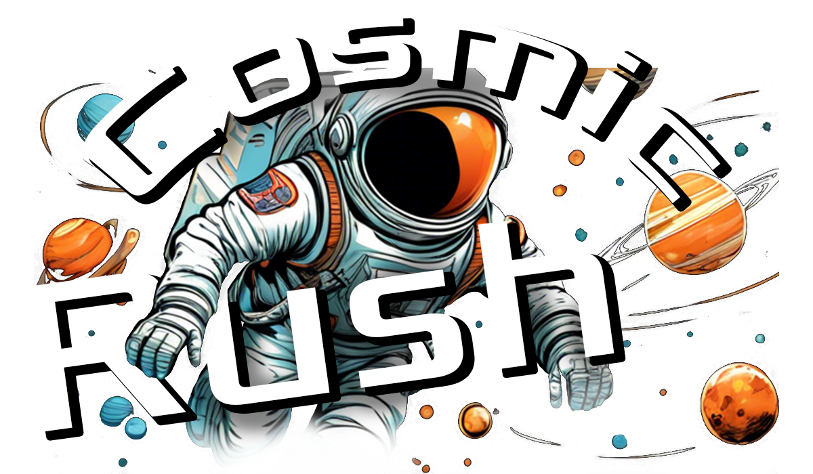

<!---

--->

 **Takım İsmi**

Time Guards

# Ürün İle İlgili Bilgiler

PC,Mac

## Takım Elemanları

- Gülsüm Kırvar: Product Owner
- Gülsüm Kırvar: Scrum Master
- Hazar Çakan: Developer
- Gülizar Rabia Çakan: Developer
- Gamze Nur Erdem: Developer

## Ürün İsmi

Cosmic Rush

## Ürün Açıklaması

- Uzayın derinliklerinde heyecan verici bir maceraya atılmanızı sağlayan,keşif ve strateji odaklı bir 3D oyunudur. oyuncular,yüksek teknolojiye sahip bir uzay gemisini kontrol ederek,keşfedilmemiş gezegenlerde kaynaklar toplar ve insanlığın hayatta kalması için hayati önem taşıyanmalzemeleri geri getirir.

## Ürün Özellikleri

- Gezegen keşfi
- Stratejik Kaynak Yönetimi
- Gerçekçi Uzay Gemisi Kontrolleri
- insanlığın Geleceğine Katkıda Bulunur

## Hedef Kitle

- 10-35 yaş arası kullanıcılar
- Bilim Kurgu Temasına ilgi duyanlar
- Gamer Komüniteleri ve Forumlar
- Kapsayıcı oyun deneyimi arayanlar

## Product Backlog URL

[Trello](https://trello.com/b/9zvnilY9/cosmic-rush-from-time-guards)

---

# Sprint 1

- **Sprint Notları**: oyunun içeriği trello dosyası ile product backlog'ların içine yazılmıştır. Product backlog item'lara tıklandığında oyunun detayları okunabilir.

- **Sprint içinde tamamlanması tahmin edilen puan**: 100 Puan

- **Puan tamamlama mantığı**: Toplamda proje boyunca tamamlanması gereken 380 puanlık backlog bulunmaktadır. 4 sprint'e bölündüğünde ilk sprint'in en azından 100 ile başlaması gerektiğine karar verildi.

- **Backlog düzeni ve Story seçimleri**: Backlog'umuz ilk yapılacak story'lere göre düzenlenmiştir. Sprint başına tahmin edilen puan sayısını geçmeyecek şekilde sıradan seçimler yapılmaktadır. Story başına çıkan tahmin puanı, toplam puanın yarısından az tutulmuştur.
oyun ile ilgili blacklog düzeni ve story seçimleri trello tablosunda açık bir şekilde belirtilmiştir.

- **Daily Scrum**: Daily Scrum toplantılarının zamansal sebeplerden ötürü WhatsApp ve Discord üzerinden yapılmasına karar verilmiştir. Daily Scrum toplantısı örneği jpeg veya word olarak Readme'de tarafımızdan paylaşılmaktadır

- Ekran görüntüleri:  

- **Sprint board update**: Sprint board ekran görüntüleri:

- **Ürün Durumu:**

Taslak | Final
:-: | :-:
<video src="https://github.com/hhhhh-ckr/OUA-Bootcamp-Grup87/assets/85761842/61845bdc-bd8d-43df-b1e0-c1ec8ea19693"></video> | <video src="https://github.com/hhhhh-ckr/OUA-Bootcamp-Grup87/assets/85761842/67e32f68-86fd-4576-bc42-e42124915dad"></video>

- **Sprint Review:**

Alınan kararlar: Oyunun üretiminin planlı ilerlemesi için ekip üyelerinin her birine 2 adet gezegen tasarımı verilmiştir. Fakat bir yandan da oyunun ilerlemesi için yeterli olmamıştır. O sebeple tasarım dağılımı  bir sonraki sprint'e aktarılmıştır. Çıkan ürünün çalışmasında ve testlerinde bir problem görülmemiştir. Ekstra koyulması gereken özellikler belirlenmiştir. Sprint Review katılımcıları: Gülsüm Kırvar, Gülizar Rabia Çakan, Gamze Nur Erdem ve Hazar Çakar

- **Sprint Retrospective:**
- Takım içindeki görev dağılımıyla ilgili düzenleme yapılması kararı alınmıştıTakım, uzay gemisi kontrol mekaniklerinin başarılı bir şekilde tamamlandığını ve gezegen tasarımlarının beklentileri karşıladığını belirtti.
- Takım, uzay gemisi kontrol mekaniklerinin başarılı bir şekilde tamamlandığını ve gezegen tasarımlarının beklentileri karşıladığını belirtti.İletişim ve iş birliği yüksek seviyedeydi.
- Uzay gemisi kontrol mekaniklerinin daha iyi test edilmesi gerektiği önerildi.
- Gezegen tasarımlarının daha detaylı yapılması gerektiği belirtildi.Gelecek sprintte daha sıkı test süreçleri uygulanacak.
- Gezegen tasarımlarına daha fazla zaman ayrılacak.
- Tahmin puanları gözden geçirilmeli ve sprint planlama toplantılarında gerekli geri bildirimlerin developer'lar tarafından verildiğine emin olunmalı
- Unit test'ler için ayrılan efor/saat arttırılmalı

-**Diğer Notlar**

- N/A

---

# Sprint 2

Sprint Notları**: oyunun içeriği trello dosyası ile product backlog'ların içine yazılmıştır. Product backlog item'lara tıklandığında oyunun detayları okunabilir.

- **Sprint içinde tamamlanması tahmin edilen puan**: 100 Puan

- **Puan tamamlama mantığı**: Toplamda proje boyunca tamamlanması gereken 380 puanlık backlog bulunmaktadır. 4 sprint'e bölündüğünde ilk sprint'in en azından 100 ile başlaması gerektiğine karar verildi.

- **Backlog düzeni ve Story seçimleri**: Backlog'umuz ilk yapılacak story'lere göre düzenlenmiştir. Sprint başına tahmin edilen puan sayısını geçmeyecek şekilde sıradan seçimler yapılmaktadır. Story başına çıkan tahmin puanı, toplam puanın yarısından az tutulmuştur.
oyun ile ilgili blacklog düzeni ve story seçimleri trello tablosunda açık bir şekilde belirtilmiştir.

- **Daily Scrum**: Daily Scrum toplantılarının zamansal sebeplerden ötürü WhatsApp ve Discord üzerinden yapılmasına karar verilmiştir. Daily Scrum toplantısı örneği jpeg veya word olarak Readme'de tarafımızdan paylaşılmaktadır

  **Sprint Review:**
  Kod Yazımı: Kod yazımına başlanmıştır. Hatalı kodlar üzerinde yeniden çalışılarak düzeltmeler yapılmaktadır. Bu süreçte kodun stabilitesini ve performansını artırmak için gerekli tüm iyileştirmeler yapılacaktır.
 Gezegen Tasarımları: Gezegen tasarımlarının bir kısmı tamamlanmıştır. İlk sprint planına göre kullanılacak site bulunmuş olup, gezegen tasarımlarının kalan kısmı üzerinde çalışılmaktadır. Oyunun mekaniği hakkında bazı değişikliklere gidilmiş ve bu değişiklikler doğrultusunda gezegen tasarımları güncellenmiştir.
 Harita Çalışmaları: Şu anda harita üzerinde çalışmalar devam etmektedir. Haritanın oyunculara daha iyi bir oyun deneyimi sunabilmesi için ayrıntılı bir şekilde tasarlanmaktadır.
 İş Bölümü: Grup içinde iş bölümü yapılmış olup, her bir üyenin iki gezegen tasarlaması istenmiştir. Bu şekilde, takım üyeleri arasında görevlerin eşit dağılımı sağlanmış ve tasarım süreci hızlandırılmıştır.

Alınan kararlar: Sprint Review katılımcıları: Gülsüm Kırvar, Gülizar Rabia Çakan, Gamze Nur Erdem ve Hazar Çakar

 **Sprint Retrospective:**

  - Neler İyi Gitti:

Kod Yazımı: Kod yazımına başarılı bir şekilde başlandı ve hatalı kodlar üzerinde düzeltmeler yapıldı. Bu süreçte takımın koordinasyonu ve işbirliği oldukça iyiydi.

Gezegen Tasarımları: Gezegen tasarımlarının bir kısmı başarıyla tamamlandı ve kullanılan site bulundu. Tasarımlar, oyunun mekanik değişikliklerine uyumlu hale getirildi.

İş Bölümü: Grup içinde iş bölümü etkili bir şekilde yapıldı. Her bir üyenin iki gezegen tasarlaması kararı, işlerin daha verimli ilerlemesini sağladı.

 Neler İyi Gitmedi:

Kod Yazımı: Bazı hataların düzeltilmesi beklenenden uzun sürdü, bu da zaman planlamasında aksamalara yol açtı.

Gezegen Tasarımları: Bazı gezegen tasarımlarının beklenenden uzun sürmesi, projenin diğer aşamalarını etkiledi.

Harita Çalışmaları: Harita üzerinde yapılan çalışmalar istenilen hızda ilerlemedi ve bu da projenin genel ilerleyişini olumsuz etkiledi.
Eylem Planı:
Test ve İnceleme: Kod yazımı sırasında otomatik testler ve kod incelemeleri artırılacak.

Planlama: Tasarım aşamaları için daha realist zaman planlamaları yapılacak ve bu planlamalar düzenli olarak gözden geçirilecek.

İletişim: Harita çalışmaları ve diğer önemli süreçler için düzenli toplantılar düzenlenecek, ekip içi iletişim artırılacak.

-**Diğer Notlar**

Sprint Hedefleri:

Kod yazımının devam etmesi ve hataların düzeltilmesi.

Gezegen tasarımlarının tamamlanması ve oyunun mekaniğine uyarlanması.

Harita çalışmalarının ilerletilmesi.

Grup üyelerinin belirlenen gezegen tasarımlarını bitirmesi.

Bu sprint sonunda, oyunun daha oynanabilir bir versiyonuna ulaşmayı ve tüm tasarımların tamamlanmasını hedefliyoruz.

---

# Sprint 3

---
